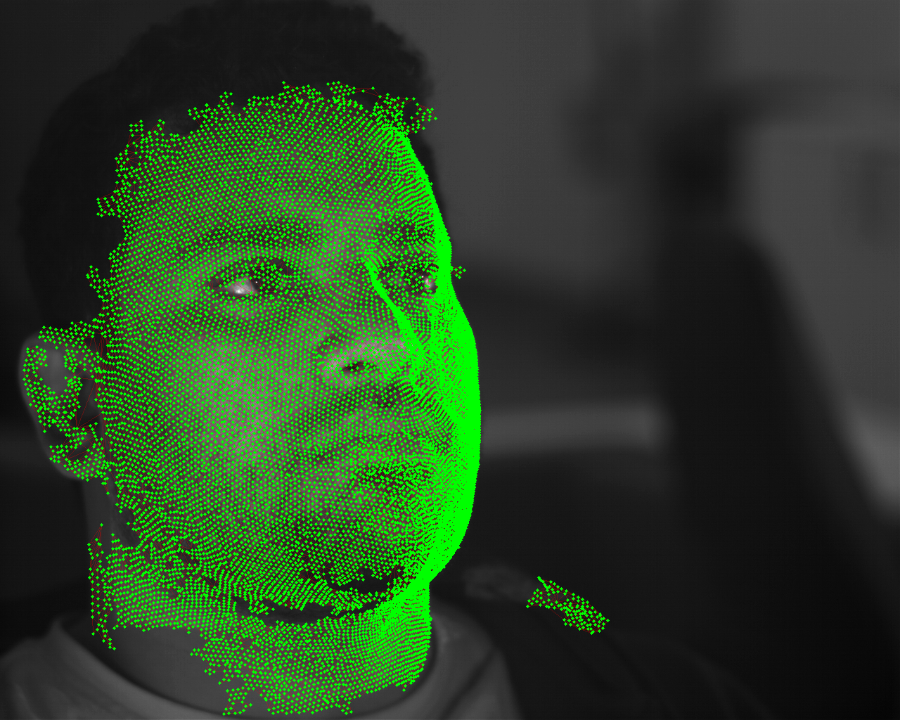
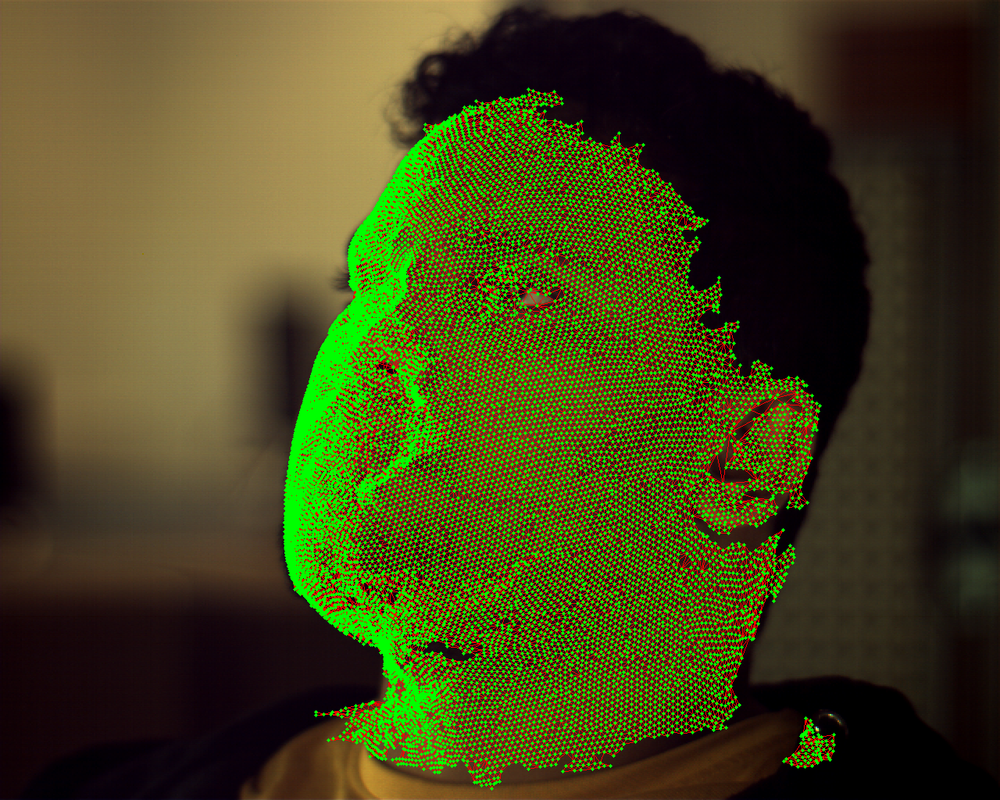

# 3dMD Mesh Projection Tool

A Python tool for projecting 3D meshes onto 2D camera images from 3dMD multi-camera systems.

## Features

- Projects 3D meshes with multicamera support
- Supports both 3dMD ground-truth meshes and reconstructed meshes
- Interactive 3D mesh viewing
- Generates projection overlays showing mesh wireframes on camera images

This tool integrates into a broader 4D facial analysis pipeline, supporting 3dMD rig setups and my custom 3D reconstruction workflow. Ideal for validating alignment, visualizing reprojection accuracy, and debugging stereo reconstruction artifacts.

## Camera Setup

The system supports 3dMD 6-camera configuration
- **1A, 1B**: Left stereo pair (vertical setup, grayscale)
- **2A, 2B**: Right stereo pair (vertical setup, grayscale) 
- **1C**: Left texture camera (color)
- **2C**: Right texture camera (color)

## Requirements

- Python 3.11+
- OpenCV 4.8+
- Open3D 0.18+
- NumPy 1.24+
- PIL/Pillow 9.5+

```bash
# Install dependencies
# Using uv (recommended)
uv sync

# Or with pip
pip install -e .
```

## Data Structure

Data should be organized like 

```
data/
└── sequence1/
    ├── calib/
    │   ├── calib_1A.tka
    │   ├── calib_1B.tka
    │   ├── calib_1C.tka
    │   ├── calib_2A.tka
    │   ├── calib_2B.tka
    │   └── calib_2C.tka
    ├── frames/
    │   ├── STEREO_1A_000.bmp
    │   ├── STEREO_1B_000.bmp
    │   ├── STEREO_2A_000.bmp
    │   ├── STEREO_2B_000.bmp
    │   ├── TEXTURE_1C_000.bmp
    │   └── TEXTURE_2C_000.bmp
    └── meshes/
        ├── frame_000.obj    # 3dMD ground-truth or reconstructed mesh
        ├── frame_001.obj
        └── ...
```

## Calibration File Format

The tool reads 3dMD .tka calibration files with the following parameters:
- **%M**: 3x3 rotation matrix (world to camera)
- **%X, %Y, %Z**: Camera position in world coordinates
- **%f**: Focal length (mm)
- **%K, %K2**: Radial distortion coefficients
- **%x, %y**: Pixel size (mm)
- **%a, %b**: Principal point (pixels)
- **%is**: Image size (width height)

## Usage

### Commands

```bash
# List available data
python main.py data/sequence1 --list

# Project mesh onto all cameras
python main.py data/sequence1 --project --frame 0

# View 3D mesh interactively
python main.py data/sequence1 --view-mesh data/sequence1/meshes/frame_000.obj
```

### Project Different Mesh Types

```bash
# Project 3dMD ground-truth mesh
python main.py data/sequence1 --project --frame 0

# Project reconstructed mesh (same command works)
python main.py data/sequence1 --project --frame 5

# Project onto specific cameras only
python main.py data/sequence1 --project --frame 0 --cameras 1A 1B
```

## Output

The tool generates:
- **Projection overlays**: PNG images showing mesh vertices and wireframe projected onto camera images
- **File naming**: `projection_{camera_id}_frame_{frame_number:03d}.png`


<table>
    <tr>
        <th>Grayscale Camera Projection</th>
        <th>Color Camera Projection</th>
    </tr>
    <tr>
        <td align="center">
            <br>
            <em>Mesh wireframe projected onto grayscale stereo camera image</em>
        </td>
        <td align="center">
            <br>
            <em>Mesh wireframe projected onto color texture camera with subject's face</em>
        </td>
    </tr>
</table>

## Acknowledgments

We gratefully acknowledge the participants who volunteered for the 3D facial data collection, whose contributions were essential to the success of this project.

The complete dataset used in this project is available at [Zenodo](https://doi.org/10.5281/zenodo.15397513).


